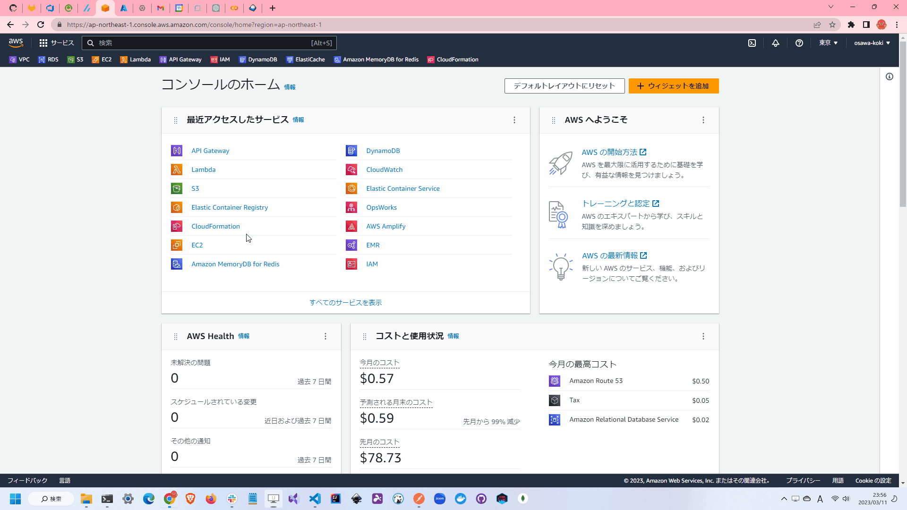

# simple-tutorial-lamda-s3

🐄🐄🐄 "API Gateway" + "Lambda" + "S3のサンプルです。  

目的はバイナリを扱うための学習をすることでしたが、よく分からないで終わりました。  
AWSは使いづらいです。  
AzureやGCPの方が使いやすいと思いました。  

## AWSのUIが悪すぎる、、、

  

さすがにヤバすぎる、、、  
